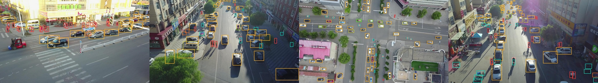
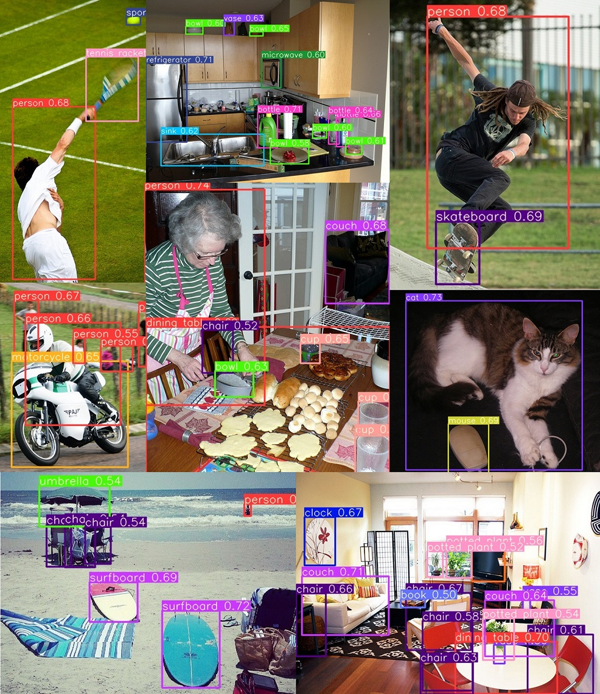

# <a href="https://www.bit.edu.cn"></a> EdgeYOLO: anchor-free, edge-friendly

<div align="center">

[简体中文](README_CN.md)

</div>


**[1 Intro](#intro)**</br>
**[2 Updates](#updates)**</br>
**[3 Coming Soon](#coming-soon)**</br>
**[4 Models](#models)**</br>
**[5 Quick Start](#quick-start)**</br>
$\quad$[5.1 setup](#setup)</br>
$\quad$[5.2 inference](#inference)</br>
$\quad$[5.3 train](#train)</br>
$\quad$[5.4 evaluate](#evaluate)</br>
$\quad$[5.5 export onnx & tensorrt](#export-onnx--tensorrt)</br>
**[6 Cite EdgeYOLO](#cite-edgeyolo)**</br>
**[7 Bugs found currently](#bugs-found-currently)**

## Intro
- In embeded device such as Nvidia Jetson AGX Xavier, EdgeYOLO reaches 34FPS with **50.6**% AP in COCO2017 dataset and **25.9**% AP in VisDrone2019 **(image input size is 640x640, batch=16, post-process included)**. And for smaller model EdgeYOLO-S, it reaches 53FPS with **44.1**% AP and **63.3**% AP<sup>0.5</sup>(**SOTA** in P5 small models) in COCO2017.
- we provide a more effective data augmentation during training.
- small object and medium object detect performace is imporved by using RH loss during the last few training epochs.
- Our pre-print paper is released on [**arxiv**](https://arxiv.org/abs/2302.07483).

## Updates
**[2023/2/28]** 
1. Evaluation for TensorRT model is supported now. <br>

**[2023/2/24]** 
1. EdgeYOLO supports [dataset with yolo format](https://github.com/LSH9832/edgeyolo/blob/main/params/dataset/yolo.yaml) now. <br>
2. Fix some errors and bugs(which happened when using "--loop" in linux cpp, and caching labels in distributed training).

**[2023/2/20]** <br>
1. [TensorRT cpp inference console demo](https://github.com/LSH9832/edgeyolo/tree/main/cpp/console) (lib **opencv** and **qt5** required) <br>
2. Fix bugs when exporting models using Version 7.X TensorRT<br>

**[2023/2/19]** 
1. Publish TensorRT int8 export code with **Calibration** (**torch2trt** is required)

## Coming Soon
- MNN deployment code
- More different models
- C++ code for TensorRT inference with UI
- EdgeYOLO-mask for segmentation task
- Simple but effective pretrain method

## Models

- models trained on COCO2017-train

| Model | Size | mAP<sup>val<br/>0.5:0.95 | mAP<sup>val<br/>0.5 | FPS<sup>AGX Xavier<br/>trt fp16 batch=16 <br/>include NMS | Params<br/>train / infer</br><sup>(M) |Download|
|:------|:----:|:------------------------:|:-------------------:|:---------------------------------------------------------:|:-------------------------------------:|:------:|
|**EdgeYOLO-Tiny-LRELU**|416</br>640|33.1</br>37.8|50.5</br>56.7|**206**</br>109|7.6 / 7.0  |[**github**](https://github.com/LSH9832/edgeyolo/releases/download/v0.0.0/edgeyolo_tiny_lrelu_coco.pth)|
|**EdgeYOLO-Tiny**      |416</br>640|37.2</br>41.4|55.4</br>60.4|136</br>67     |5.8 / 5.5  |[**github**](https://github.com/LSH9832/edgeyolo/releases/download/v0.0.0/edgeyolo_tiny_coco.pth)|
|**EdgeYOLO-S**         |640        |44.1         |**63.3**     |53             |9.9 / 9.3  |[**github**](https://github.com/LSH9832/edgeyolo/releases/download/v0.0.0/edgeyolo_s_coco.pth)|
|**EdgeYOLO-M**         |640        |47.5         |66.6         |46             |19.0 / 17.8|[**github**](https://github.com/LSH9832/edgeyolo/releases/download/v0.0.0/edgeyolo_m_coco.pth)|
|**EdgeYOLO**           |640        |50.6         |69.8         |34             |41.2 / 40.5|[**github**](https://github.com/LSH9832/edgeyolo/releases/download/v0.0.0/edgeyolo_coco.pth)|

- models trained on VisDrone2019 (pretrained backbone on COCO2017-train)

1. We use [ VisDrone2019-DET dataset with COCO format ](https://github.com/LSH9832/edgeyolo/releases/download/v1.0.0/visdrone_coco.zip) in our training.
2. Here's the results without removing detect boxes in **ignored region**

| Model | Size | mAP<sup>val<br/>0.5:0.95 | mAP<sup>val<br/>0.5 |Download|
|:------|:----:|:------------------------:|:-------------------:|:------:|
|**EdgeYOLO-Tiny-LRELU**|416</br>640|12.1</br>18.5|22.8</br>33.6|[**github**](https://github.com/LSH9832/edgeyolo/releases/download/v0.0.0/edgeyolo_tiny_lrelu_visdrone.pth)|
|**EdgeYOLO-Tiny**      |416</br>640|14.9</br>21.8|27.3</br>38.5|[**github**](https://github.com/LSH9832/edgeyolo/releases/download/v0.0.0/edgeyolo_tiny_visdrone.pth)|
|**EdgeYOLO-S**         |640        |23.6         |40.8         |[**github**](https://github.com/LSH9832/edgeyolo/releases/download/v0.0.0/edgeyolo_s_visdrone.pth)|
|**EdgeYOLO-M**         |640        |25.0         |42.9         |[**github**](https://github.com/LSH9832/edgeyolo/releases/download/v0.0.0/edgeyolo_m_visdrone.pth)|
|**EdgeYOLO**           |640        |25.9</br>26.9|43.9</br>45.4|[**github(legacy)**](https://github.com/LSH9832/edgeyolo/releases/download/v0.0.0/edgeyolo_visdrone.pth)</br>[**github(new)**](https://github.com/LSH9832/edgeyolo/releases/download/v1.0.0/edgeyolo_visdrone.pth)|

<details>
<summary>Some of our detect results in COCO2017</summary>

COCO2017


</details>

## Quick Start
### setup

```shell
git clone https://github.com/LSH9832/edgeyolo.git
cd edgeyolo
pip install -r requirements.txt
```

if you use tensorrt, please make sure torch2trt and TensorRT Development Toolkit(version>7.1.3.0) are installed.

```shell
git clone https://github.com/NVIDIA-AI-IOT/torch2trt.git
cd torch2trt
python setup.py install
```
or to make sure you use the same version of torch2trt as ours, [download here](https://github.com/LSH9832/edgeyolo/releases/download/v1.0.0/torch2trt.zip)

### inference

**First [download weights here](https://github.com/LSH9832/edgeyolo/releases/tag/v0.0.0)**

```shell
python detect.py --weights edgeyolo_coco.pth --source XXX.mp4 --fp16

# all options
python detect.py --weights edgeyolo_coco.pth 
                 --source /XX/XXX.mp4     # or dir with images, such as /dataset/coco2017/val2017    (jpg/jpeg, png, bmp, webp is available)
                 --conf-thres 0.25 
                 --nms-thres 0.5 
                 --input-size 640 640 
                 --batch 1 
                 --save-dir ./output/detect/imgs    # if you press "s", the current frame will be saved in this dir
                 --fp16 
                 --no-fuse                # do not reparameterize model
                 --no-label               # do not draw label with class name and confidence
                 --mp                     # use multi-process to show images more smoothly when batch > 1
                 --fps 30                 # max fps limitation, valid only when option --mp is used
```

### train
- first prepare your dataset and create dataset config file(./params/dataset/XXX.yaml), make sure your dataset config file contains:

(COCO, YOLO, VOC, VisDrone and DOTA formats are supported)
```yaml
type: "coco"                        # dataset format(lowercase)，COCO, YOLO, VOC, VisDrone and DOTA formats are supported currently
dataset_path: "/dataset/coco2017"   # root dir of your dataset

kwargs:
  suffix: "jpg"        # suffix of your dataset's images
  use_cache: true      # test on i5-12490f: Total loading time: 52s -> 10s(seg enabled) and 39s -> 4s(seg disabled)

train:
  image_dir: "images/train2017"                   # train set image dir
  label: "annotations/instances_train2017.json"   # train set label file(format with single label file) or directory(multi label files)

val:
  image_dir: "images/val2017"                     # evaluate set image dir
  label: "annotations/instances_val2017.json"     # evaluate set label file or directory

test:
  test_dir: "test2017"     # test set image dir (not used in code now, but will)

segmentaion_enabled: true  # whether this dataset has segmentation labels and you are going to use them instead of bbox labels

names: ['person', 'bicycle', 'car', 'motorcycle', 'airplane', 'bus', 'train', 'truck', 'boat', 'traffic light',
        'fire hydrant', 'stop sign', 'parking meter', 'bench', 'bird', 'cat', 'dog', 'horse', 'sheep', 'cow',
        'elephant', 'bear', 'zebra', 'giraffe', 'backpack', 'umbrella', 'handbag', 'tie', 'suitcase', 'frisbee',
        'skis', 'snowboard', 'sports ball', 'kite', 'baseball bat', 'baseball glove', 'skateboard', 'surfboard',
        'tennis racket', 'bottle', 'wine glass', 'cup', 'fork', 'knife', 'spoon', 'bowl', 'banana', 'apple',
        'sandwich', 'orange', 'broccoli', 'carrot', 'hot dog', 'pizza', 'donut', 'cake', 'chair', 'couch',
        'potted plant', 'bed', 'dining table', 'toilet', 'tv', 'laptop', 'mouse', 'remote', 'keyboard', 'cell phone',
        'microwave', 'oven', 'toaster', 'sink', 'refrigerator', 'book', 'clock', 'vase', 'scissors', 'teddy bear',
        'hair drier', 'toothbrush']    # category names
```
- then edit file ./params/train/train_XXX.yaml
- finally
```shell
python train.py --cfg ./params/train/train_XXX.yaml
```

### evaluate
```shell
python evaluate.py --weights edgeyolo_coco.pth --dataset params/dataset/XXX.yaml --batch 16 --device 0

# all options
python evaluate.py --weights edgeyolo_coco.pth        # or tensorrt model: output/export/edgeyolo_coco/model.pt
                   --dataset params/dataset/XXX.yaml 
                   --batch 16                         # batch size for each gpu, not valid if it's tensorrt model
                   --device 0
                   --input-size 640 640               # height, width
                   --trt                              # if you use tensorrt model add this option
                   --save                             # save weights without optimizer params and set epoch to -1
```

### export onnx & tensorrt
- ONNX
```shell
python export.py --onnx --weights edgeyolo_coco.pth --batch 1

# all options
python export.py --onnx   # or --onnx-only if tensorrt and torch2trt are not installed
                 --weights edgeyolo_coco.pth 
                 --input-size 640 640   # height, width
                 --batch 1
                 --opset 11
                 --no-simplify    # do not simplify this model
```
it generates
```
output/export/edgeyolo_coco/640x640_batch1.onnx
```
- TensorRT
```shell
# fp16
python export.py --trt --weights edgeyolo_coco.pth --batch 1 --workspace 8

# int8
python export.py --trt --weights edgeyolo_coco.pth --batch 1 --workspace 8 --int8 --dataset params/dataset/coco.yaml --num-imgs 1024

# all options
python export.py --trt                       # you can add --onnx and relative options to export both models
                 --weights edgeyolo_coco.pth
                 --input-size 640 640        # height, width
                 --batch 1
                 --workspace 10              # (GB)
                 --no-fp16        # fp16 mode in default, use this option to disable it(fp32)
                 --int8           # int8 mode, the following options are needed for calibration
                 --datset params/dataset/coco.yaml   # generates calibration images from its val images(upper limit：5120)
                 --train          # use train images instead of val images(upper limit：5120)
                 --all            # use all images(upper limit：5120)
                 --num-imgs 512   # (upper limit：5120)
```
it generates
```
(optional) output/export/edgeyolo_coco/640x640_batch1.onnx
output/export/edgeyolo_coco/640x640_batch1_fp16(int8).pt       # for python inference
output/export/edgeyolo_coco/640x640_batch1_fp16(int8).engine   # for c++ inference
output/export/edgeyolo_coco/640x640_batch1_fp16(int8).json     # for c++ inference
```

#### Benchmark of TensorRT Int8 Model 
- enviroment: TensorRT Version 8.2.5.1, Windows, i5-12490F, RTX 3060 12GB
- For TensorRT, **diffirent calib dataset can cause appearent difference in both precision and speed. I think that's why most of official project didn't give int8 quantization results.** The table below is of little reference significance, I think.


COCO2017-TensorRT-int8

| Int8 Model  | Size |Calibration </br>Image number|Workspace</br><sup>(GB)| mAP<sup>val<br/>0.5:0.95 | mAP<sup>val<br/>0.5 |FPS<sup>RTX 3060<br/>trt int8 batch=16 <br/>include NMS|
|:-------|:----:|:---:|:---:|:---:|:---:|:---:|
|**Tiny-LRELU**|416<br>640|512|8   |31.5<br>36.4 |48.7<br>55.5 |730<br>360 |
|**Tiny**|416<br>640|512  |8    |34.9<br>39.8|53.1<br>59.5|549<br>288|
|**S**   |640   |512  |8    |42.4 |61.8 | 233 |
|**M**   |640   |512  |8    |45.2 |64.2 | 211 |
|**L**   |640   |512  |8    |49.1 |68.0 | 176 |

#### for python inference
```shell
python detect.py --trt --weights output/export/edgeyolo_coco/640x640_batch1_int8.pt --source XXX.mp4

# all options
python detect.py --trt 
                 --weights output/export/edgeyolo_coco/640x640_batch1_int8.pt 
                 --source XXX.mp4
                 --legacy         # if "img = img / 255" when you train your train model
                 --use-decoder    # if use original yolox tensorrt model before version 0.3.0
                 --mp             # use multi-process to show images more smoothly when batch > 1
                 --fps 30         # max fps limitation, valid only when option --mp is used
```

#### for c++ inference
```shell
# build
cd cpp/console/linux
mkdir build && cd build
cmake ..
make -j4

# help
./yolo -?
./yolo --help

# run
# ./yolo [json file] [source] [--conf] [--nms] [--loop] [--no-label]
./yolo ../../../../output/export/edgeyolo_coco/640x640_batch1_int8.json ~/Videos/test.avi --conf 0.25 --nms 0.5 --loop --no-label
```

## Cite EdgeYOLO
```
@article{edgeyolo2023,
  title={EdgeYOLO: An Edge-Real-Time Object Detector},
  author={Shihan Liu, Junlin Zha, Jian Sun, Zhuo Li, and Gang Wang},
  journal={arXiv preprint arXiv:2302.07483},
  year={2023}
}
```

## Bugs found currently
- Sometimes it raises error as follows during training. Reduce pytorch version to 1.8.0 might solve this problem.
```
File "XXX/edgeyolo/edgeyolo/train/loss.py", line 667, in dynamic_k_matching
_, pos_idx = torch.topk(cost[gt_idx], k=dynamic_ks[gt_idx].item(), largest=False)
RuntimeError: CUDA error: device-side assert triggered
CUDA kernel errors might be asynchronously reported at some other API call,so the stacktrace below might be incorrect.
For debugging consider passing CUDA_LAUNCH_BLOCKING=1.
```
- For DOTA dataset, we only support single GPU training mode now, please do not train DOTA dataset with distributed mode or model can not be trained correctly.
- Sometimes converting to TensorRT fp16 model with 8.4.X.X or higher version might lose a lot of precision, please use TensorRT Verson 7.X.X.X or 8.2.X.X
