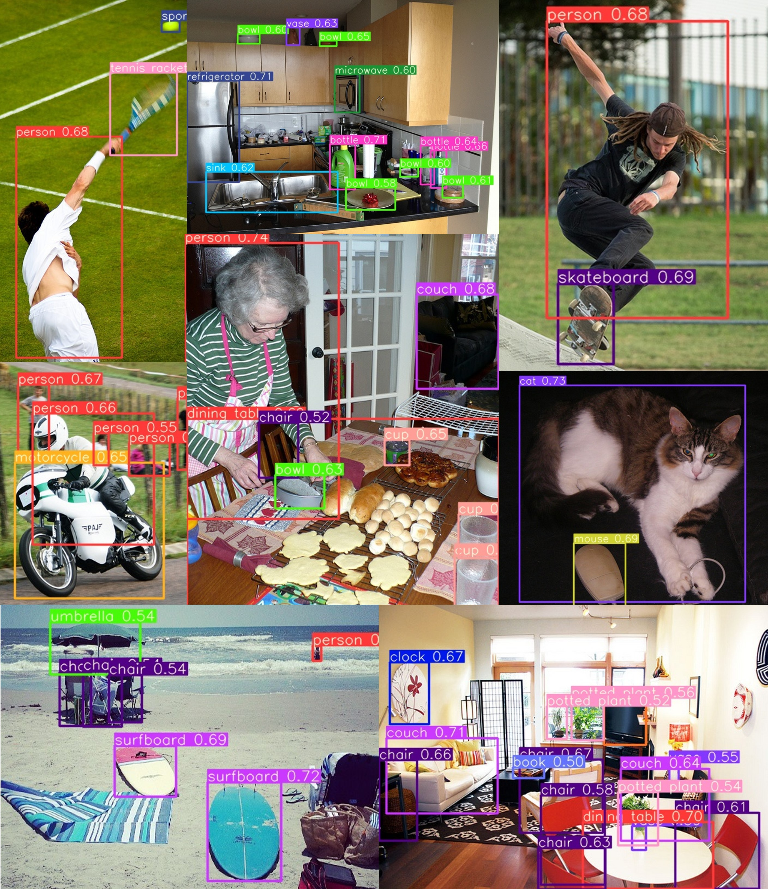
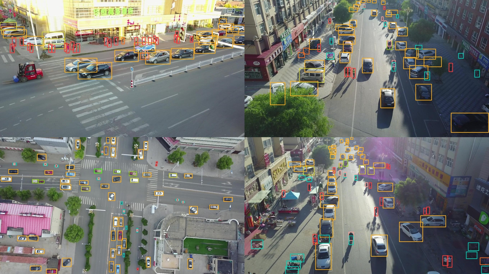

# EdgeYOLO: anchor-free, edge-computing-device-friendly

This is a **trial version** without training code and evaluate code. we will publish complete source code after we publish our paper online.

## Intro
- In embeded device such as Nvidia Jetson AGX Xavier, Edge-YOLO reaches 34fps with 50.6%AP in COCO2017 dataset and 25.8%AP in VisDrone2019 **(image input size is 640x640, batch=16, post-process included)**
- we provide a more effective data augmentation during training.
- small object and medium object detect performace is imporved by using RH loss during the last few training epochs.

<div align="center"></div>
<div align="center"></div>

## Coming Soon
- **train code.** After our paper is released on arXiv, we will publish train code.
- **evaluate code.** After our paper is released on arXiv, we will publish evaluate code.

## Quick Start
### setup

```bash
git clone https://github.com/LSH9832/edgeyolo.git
cd edgeyolo
pip install -r requirements.txt
```
if you use tensorrt, please make sure torch2trt is installed
```
git clone https://github.com/NVIDIA-AI-IOT/torch2trt.git
cd torch2trt
python setup.py install
```

### inference

**First [download weights here](https://github.com/LSH9832/edgeyolo/releases/tag/v0.0.0)**

```
python detect.py --weights edgeyolo_coco.pth --source XXX.mp4 --fp16

# full commands
python detect.py --weights edgeyolo_coco.pth 
                 --source /XX/XXX.mp4     # or dir with images, such as /dataset/coco2017/val2017    (jpg/jpeg, png, bmp, webp is available)
                 --conf-thres 0.25 
                 --nms-thres 0.5 
                 --input-size 640 640 
                 --batch-size 1 
                 --save-dir ./img/coco    # if you press "s", the current frame will be saved in this dir
                 --fp16 
                 --no-fuse                # do not fuse layers
                 --no-label               # do not draw label with class name and confidence
```
It is recomended to use **batch_detect.py** with the same commands if batch size > 1
```
python batch_detect.py --weights edgeyolo_coco.pth --source XXX.mp4 --batch-size 16 --fp16
                       --fps 30    # max fps limitation(new function)
```
### export onnx & tensorrt
```
python pth2onnx.py --weights edgeyolo_coco.pth --simplify

# full commands
python pth2onnx.py --weights edgeyolo_coco.pth 
                   --img-size 640 640 
                   --batch-size 1
                   --opset 11
                   --simplify
```
it generates file **export_output/onnx/edgeyolo_coco_640x640.onnx** and **export_output/onnx/edgeyolo_coco_640x640.yaml**

```
# (workspace: GB)
python onnx2trt.py --onnx export_output/onnx/edgeyolo_coco_640x640.onnx 
                   --yaml export_output/onnx/edgeyolo_coco_640x640.yaml 
                   --workspace 10 
                   --fp16
```
it will generate
- **export_output/tensorrt/edgeyolo_coco_640x640.pt**  for python inference
- **export_output/tensorrt/edgeyolo_coco_640x640.engine**  for c++ inference
- **export_output/tensorrt/edgeyolo_coco_640x640.txt**  for c++ inference

#### for python inference
```
python detect.py --trt --weights export_output/tensorrt/edgeyolo_coco_640x640.pt --source XXX.mp4

# full commands
python detect.py --trt 
                 --weights export_output/tensorrt/edgeyolo_coco_640x640.pt 
                 --source XXX.mp4
                 --legacy         # if "img = img / 255" when you train your train model
                 --use-decoder    # if use original yolox tensorrt model before version 0.3.0
```
It is also recomended to use **batch_detect.py** with the same commands if batch size > 1
```
python batch_detect.py --trt --weights edgeyolo_coco.pth --source XXX.mp4 --fp16
                       --fps 30    # max fps limitation(new function)
```
#### for c++ inference
it will comming soon


